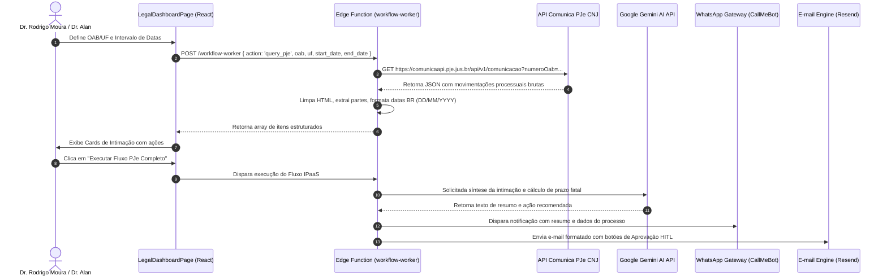

# 📄 Documento de Arquitetura As-Built: Synapse IPaaS & Módulo Jurídico PJe CNJ

**Projeto:** Synapse IPaaS Judicial & Automação de Fluxos  
**Versão da Documentação:** 2.0.0-AS-BUILT (Mapeamento Reverso Factual)  
**Data:** 13 de Agosto de 2026  
**Autor:** Antigravity AI Engineering Team  

---

## 📑 Sumário Executivo

Este documento apresenta a arquitetura técnica real (*As-Built*) do projeto **Synapse**, mapeada diretamente a partir do código-fonte armazenado no repositório. O sistema é composto por duas vertentes integradas:

1. **Módulo 1: Construtor de Fluxos (IPaaS - Integration Platform as a Service)**: Engine visual interativo baseado em grafo orientado (DAG) para criação, teste, publicação e execução de automações multi-etapas.
2. **Módulo 2: Suíte Jurídica & Automação PJe CNJ**: Sistema de busca em tempo real de movimentações e intimações processuais via API pública do CNJ Comunica PJe, integrando Inteligência Artificial (Google Gemini), Notificações WhatsApp, e-mails interativos com aprovação humana (HITL) e integração com Google Agenda.

---

## 🌳 1. Árvore de Diretórios Críticos do Projeto

Abaixo está a representação visual factual da estrutura do repositório (`apps/web/src` e `supabase/functions`):

```
embedded-ipaas-workflow/
├── apps/
│   └── web/                                  # Aplicação Web SPA (React 18 + Vite + TypeScript)
│       ├── src/
│       │   ├── App.tsx                       # Orquestrador central de estado, roteamento e colaboração Yjs
│       │   ├── main.tsx                      # Ponto de entrada do React DOM
│       │   ├── index.css                     # Design System Vanilla CSS (Design Tokens, Temas Dark/Light)
│       │   ├── components/                   # Componentes da Interface de Usuário
│       │   │   ├── WorkflowCanvas.tsx        # Canvas principal do React Flow (@xyflow/react)
│       │   │   ├── CustomNode.tsx            # Componente de nó customizado (15 tipos de nós)
│       │   │   ├── NodeConfigModal.tsx       # Modal de configuração avançada de parâmetros de nós
│       │   │   ├── NodePropertiesDrawer.tsx  # Drawer lateral para inspeção de schemas e testes
│       │   │   ├── CopilotPromptBar.tsx      # Barra de comandos para geração de fluxos por IA
│       │   │   ├── LegalDashboardPage.tsx    # Painel Principal de Intimações e Processos PJe CNJ
│       │   │   ├── LegalCopilotChat.tsx      # Chat de Redação de Peças Processuais (Legal Copilot)
│       │   │   ├── AiAnalyticsDashboard.tsx  # Dashboard Factual de Consumo de IA e Comparativo Google Ultra
│       │   │   ├── DashboardPage.tsx         # Dashboard IPaaS de Gerenciamento de Fluxos e Pastas
│       │   │   ├── ExecutionsPage.tsx        # Painel de Logs e Histórico de Execuções de Fluxos
│       │   │   ├── ApprovalPage.tsx          # Interface HITL de Decisão Human-in-the-Loop
│       │   │   ├── MasterAdminPage.tsx       # Painel de Administração Global Master (Tenants e Cotas)
│       │   │   ├── TenantAdminPage.tsx       # Painel de Administração do Tenant (Membros e Edições)
│       │   │   └── AppLayout.tsx             # Layout mestre com Sidebar responsiva colapsável e Navbar
│       │   ├── services/
│       │   │   └── LegalAiService.ts         # Motor Triplo de Resiliência de IA (Edge -> Gemini REST -> Local)
│       │   ├── context/
│       │   │   └── ThemeContext.tsx          # Contexto de Gerenciamento de Temas e Edições de Planos
│       │   ├── i18n/
│       │   │   └── LanguageContext.tsx       # Sistema de Internacionalização (PT-BR / EN)
│       │   ├── collaboration/
│       │   │   ├── useYjsCollaboration.ts    # Hook de Colaboração Multiplayer em Tempo Real (Yjs + WebSockets)
│       │   │   └── LiveCursors.tsx           # Renderizador de Cursores Remotos ao Vivo no Canvas
│       │   └── lib/
│       │       ├── supabase.ts               # Instância do Cliente Supabase JS
│       │       └── api.ts                    # Utilitários de roteamento e chamadas API
├── packages/
│   ├── shared-types/                         # Monorepo Package: Tipagens Compartilhadas TypeScript
│   │   └── src/index.ts                      # Interfaces do Modelo de Dados (Flowchart, WorkflowNode, PlanTier)
│   └── database/                             # Schemas SQL e Mapeamento de Banco de Dados
│       ├── migrations/
│       │   ├── 001_full_schema.sql           # Schema base de fluxos, execuções e tokens
│       │   ├── 005_rls_and_vault.sql         # Segurança RLS e Cofre de Credenciais Encripitadas
│       │   └── 006_editions_enum.sql         # Definição das 5 Edições do Sistema
│       └── templates.json                    # Galeria de Templates Pré-Construídos
└── supabase/
    ├── functions/                            # Backend Deno Serverless (Edge Functions)
    │   ├── workflow-worker/index.ts          # Motor de Execução de Fluxos IPaaS & Operário PJe (2.012 linhas)
    │   ├── legal-copilot/index.ts            # Servidor Edge de Redação Jurídica via IA Gemini
    │   ├── webhook-handler/index.ts          # Receptor de Gatilhos Webhook Externos
    │   ├── workflow-scheduler/index.ts       # Cron Job Runner de Fluxos Agendados
    │   ├── approve-step/index.ts             # Gateway de Decisões de Aprovação Humana (HITL)
    │   └── _shared/cors.ts                   # Handler Único de Cabeçalhos CORS
    └── migrations/                           # Migrações Versionadas do Banco PostgreSQL
```

---

## 🛠️ 2. Mapeamento do Módulo 1: Construtor de Fluxos (IPaaS)

### 2.1 Componentes React da Interface

O construtor de fluxos é estruturado sobre a biblioteca `@xyflow/react` v12 (antigo React Flow) e compreende quatro componentes fundamentais:

1. **`WorkflowCanvas.tsx`**:
   - Atua como a superfície principal de modelagem visual.
   - Implementa suporte a arrastar-e-soltar (`onDragOver`, `onDrop`) a partir da barra de ferramentas ou da visualização mobile (`MobileNodeListView.tsx`).
   - Integra suporte a cursores multiplayer em tempo real via `LiveCursors.tsx`.
   - Oferece barra integrada de geração rápida de fluxos com linguagem natural via `CopilotPromptBar.tsx`.
   - Disponibiliza exportação nativa do fluxo para os formatos **PDF**, **PPTX (PowerPoint)** e **Imagem PNG**.

2. **`CustomNode.tsx`**:
   - Renderizador universal de nós customizados com suporte a 15 tipos de etapas:
     - `trigger`, `schedule`, `email_trigger`, `email_approval`, `whatsapp`, `teams`, `action`, `decision`, `approval`, `output`, `code`, `media`, `http`, `jump`, `end`.
   - Renderiza pontos de conexão (*Handles* de entrada e saída), crachás de status de execução (Sucesso, Executando, Falha) e indicadores visuais de bifurcação (Saídas "Sim/Não" em nós de decisão).

3. **`NodeConfigModal.tsx`**:
   - Modal dinâmico para edição de parâmetros de nós:
     - **Nó HTTP**: Método (`GET`, `POST`, `PUT`, `DELETE`), URL, Headers e Payload JSON.
     - **Nó Schedule**: Regras de recorrência Cron (Diário, Semanal, Mensal).
     - **Nó Email Trigger**: Filtros de remetente, assunto, domínio e ação em anexos.
     - **Nó WhatsApp**: Número de destino, mensagem dinâmica e provider (CallMeBot / Evolution API).
     - **Nó Code**: Editor de código JavaScript executado em sandbox serverless.
     - **Nó Decision**: Operadores de comparação (`equals`, `contains`, `greater_than`).

4. **`NodePropertiesDrawer.tsx`**:
   - Painel lateral deslizante para inspeção detalhada de propriedades, payloads de teste e histórico de execução individual por nó.

### 2.2 Gerenciamento de Estado dos Nós e Grafo

O estado do fluxo é mantido em React utilizando os hooks `useNodesState` e `useEdgesState` expostos pelo React Flow, sincronizados no estado principal de `App.tsx`:

- **Nós (`WorkflowNode[]`)**: Cada nó contém um identificador único (`id`), coordenadas espaciais `position: { x, y }`, o tipo do nó (`type`) e um objeto `data` que armazena rótulo, descrição e configurações específicas (`httpConfig`, `scheduleConfig`, `emailConfig`, etc.).
- **Arestas (`WorkflowEdge[]`)**: Definem a topologia da rede, conectando um nó de origem (`source`) e handle específico (`sourceHandle`) a um nó de destino (`target` e `targetHandle`).

#### Sincronização Multiplayer (Colaboração em Tempo Real)
- Gerenciada pelo hook `useYjsCollaboration.ts`. O grafo é compartilhado entre múltiplos usuários simultâneos via Yjs e WebSockets. Alterações de posição de nós ou adição de arestas são propagadas instantaneamente com reflexo dos cursores em tempo real (`LiveCursors.tsx`).

### 2.3 Persistência e Estrutura de Tabelas (Supabase)

O armazenamento opera em modelo híbrido com dupla camada (Banco PostgreSQL Supabase + Cache de resiliência em `localStorage`):

#### Esquema de Tabelas (`packages/database/migrations/001_full_schema.sql`):

```sql
-- 1. Tabela de Fluxos (Flowcharts)
CREATE TABLE flowcharts (
    id UUID PRIMARY KEY DEFAULT gen_random_uuid(),
    organization_id UUID NOT NULL REFERENCES organizations(id) ON DELETE CASCADE,
    folder_id UUID REFERENCES folders(id) ON DELETE SET NULL,
    name TEXT NOT NULL,
    description TEXT,
    nodes JSONB NOT NULL DEFAULT '[]'::jsonb,
    edges JSONB NOT NULL DEFAULT '[]'::jsonb,
    is_published BOOLEAN NOT NULL DEFAULT false,
    is_active BOOLEAN NOT NULL DEFAULT true,
    created_at TIMESTAMPTZ NOT NULL DEFAULT now(),
    updated_at TIMESTAMPTZ NOT NULL DEFAULT now()
);

-- 2. Tabela de Execuções de Fluxo (Flow Executions)
CREATE TABLE flow_executions (
    id UUID PRIMARY KEY DEFAULT gen_random_uuid(),
    workflow_id UUID NOT NULL REFERENCES flowcharts(id) ON DELETE CASCADE,
    status TEXT NOT NULL CHECK (status IN ('running', 'completed', 'paused', 'failed')),
    current_node_id TEXT,
    logs JSONB NOT NULL DEFAULT '[]'::jsonb,
    context_data JSONB NOT NULL DEFAULT '{}'::jsonb,
    started_at TIMESTAMPTZ NOT NULL DEFAULT now(),
    finished_at TIMESTAMPTZ
);

-- 3. Tabela de Tokens de Aprovação Humana (HITL)
CREATE TABLE approval_tokens (
    id UUID PRIMARY KEY DEFAULT gen_random_uuid(),
    execution_id UUID NOT NULL REFERENCES flow_executions(id) ON DELETE CASCADE,
    node_id TEXT NOT NULL,
    token TEXT NOT NULL UNIQUE,
    status TEXT NOT NULL DEFAULT 'PENDING' CHECK (status IN ('PENDING', 'APPROVED', 'REJECTED')),
    expires_at TIMESTAMPTZ NOT NULL,
    decided_at TIMESTAMPTZ,
    decided_by TEXT
);
```

---

## ⚖️ 3. Mapeamento do Módulo 2: Integração PJe / CNJ & Automação Jurídica

### 3.1 Ciclo de Vida da `LegalDashboardPage.tsx`

O painel jurídico monitora e automatiza o tratamento de intimações em tempo real:

1. **Montagem do Componente & Leitura de Parâmetros**:
   - Lê a OAB e UF cadastradas no `localStorage` (`synapse_advocate_oab` / `synapse_advocate_uf`).
   - Carrega do `localStorage` a chave `synapse_pje_last_search_<OAB>` restaurando as últimas movimentações buscadas.

2. **Consulta em Tempo Real à API PJe CNJ**:
   - Ao acionar "Buscar Movimentações PJe em Tempo Real", dispara uma chamada à Edge Function `workflow-worker` com a ação `query_pje`, informando intervalo de datas, OAB e UF.

3. **Interatividade nos Cards de Processo**:
   - **Executar Fluxo PJe Completo**: Inicia a automação E2E (Extração de intimação -> Resumo por IA -> Geração de Link de Calendário -> Notificação WhatsApp -> Envio de E-mail com Aprovação).
   - **Caixa de Diálogo da IA por Processo**: Abre um chat contextual sobre a intimação invocando o `LegalAiService.generateLegalContent()`.
   - **Sincronização com Google Agenda**: Gera instantaneamente a URL formatada do Google Calendar (`https://calendar.google.com/calendar/render...`) ou realiza o download do arquivo `.ics` RFC 5545.

### 3.2 Fluxo de Dados: Da Consulta ao Empacotamento



### 3.3 Anatomia da Edge Function `workflow-worker/index.ts`

A Edge Function `workflow-worker` (com 2.012 linhas de código em Deno TypeScript) atua como o operário central do ecossistema:

1. **Ação `query_pje`**:
   - Executa a requisição HTTP GET para o endpoint oficial do CNJ (`https://comunicaapi.pje.jus.br/api/v1/comunicacao`).
   - Normaliza os dados brutos: limpa tags HTML dos despachos, sanitiza nomes de partes e converte datas ISO para formato nacional (`DD/MM/YYYY`).

2. **Traversia do Grafo de Execução (DAG Execution Engine)**:
   - Lê a ordem dos nós a partir de `flowcharts.nodes` e `flowcharts.edges`.
   - Mantém um contexto em memória (`context_data`) que evolui a cada etapa executada.

3. **Integração com Google Gemini AI**:
   - Invoca os modelos `gemini-2.0-flash` e `gemini-1.5-pro` via chamada REST direta ou via Edge Function dedicada.

4. **Motor de E-mail & Aprovação HITL (Resend API)**:
   - Gera tokens únicos na tabela `approval_tokens`.
   - Monta um e-mail HTML estilizado utilizando a API do Resend (`https://api.resend.com/emails`), incluindo botões com links diretos de aprovação (`/approval?token=...`).

5. **Notificação de WhatsApp (CallMeBot / Evolution API)**:
   - Formata a mensagem com marcadores visuais (`⚖️`, `📌`, `🗓️`) e realiza a chamada de entrega imediata no número do advogado.

### 3.4 Arquitetura do Motor de IA Resiliente (`LegalAiService.ts`)

Para garantir disponibilidade ininterrupta durante a elaboração de peças e contestações no **Legal Copilot**, o `LegalAiService` implementa uma **Tripla Camada de Resiliência (Triple-Tier AI Fallback Engine)**:

```
[Requisição de IA Jurídica]
           │
           ▼
┌─────────────────────────────────────────┐
│ CAMADA 1: Supabase Edge Function        │
│ (legal-copilot com envio de API Key)    │
└──────────────────┬──────────────────────┘
                   │ (Falha / Non-2xx / Timeout)
                   ▼
┌─────────────────────────────────────────┐
│ CAMADA 2: Failover Direto REST Gemini   │
│ (gemini-2.0-flash / gemini-1.5-pro)     │
└──────────────────┬──────────────────────┘
                   │ (Bloqueio Total de Rede)
                   ▼
┌─────────────────────────────────────────┐
│ CAMADA 3: Failover de Emergência Local  │
│ (Minuta Jurídica Estruturada CPC/2015)  │
└─────────────────────────────────────────┘
```

---

## ⚡ 4. Pilha de Dependências Principais (Tech Stack)

### Frontend (SPA Web)
- **Framework Core**: React 18.3.1 + TypeScript 5.5 + Vite 5.4.
- **Grafo & Workflow Canvas**: `@xyflow/react` (v12.0.0).
- **Ícones**: `lucide-react`.
- **Colaboração Multiplayer**: `yjs` (v13.6.14) + `y-websocket` (v1.5.4).
- **Exportação de Documentos**: `jspdf` + `html2canvas` + `pptxgenjs`.

### Backend (Serverless Edge Functions)
- **Runtime**: Deno Runtime (Supabase Edge Functions).
- **Banco de Dados & Auth**: PostgreSQL 15 + Supabase JS Client (`@supabase/supabase-js` v2.39.0).
- **Motor de E-mail**: Resend API (`api.resend.com`).
- **Motor de IA**: Google Gemini REST API (`generativelanguage.googleapis.com/v1beta`).
- **Motor de Notificação Instantânea**: CallMeBot API / Webhook Gateway.

---

## 📌 5. Conclusão e Próximos Passos

O documento *As-Built* reflete fielmente o estado operacional do repositório Synapse. A arquitetura desacoplada permite escalar novas integrações de tribunais ou novos nós de automação sem impacto no núcleo do construtor de fluxos.

*Documento salvo na raiz do repositório em `ARQUITETURA_AS_BUILT.md`.*
